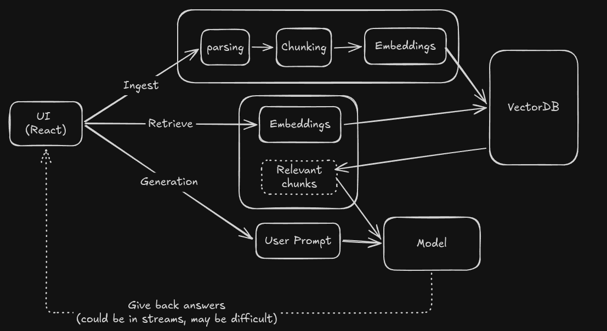

# Scientific Papers Summarizer using with Bullet Points

## Problems and Ideas

During the senior thesis or relating works that requires an intensive amount of research papers reading, sometimes the process would be terribly long, time-consuming, tedious, and prone to errors. In order to partly reduce the burden, we decided to create a project that summarizes the paper into multiple bullet points.

## Authors

- Phan Thai Hoa
- Davian

## How to run

### Dev workflow
```bash
cd src/view
npm run dev
cd ..
uv run fastapi dev # Access through the assigned port
```

### Production workflow
```bash
cd src/view && npm run build
dist/cd ../.. && src/.venv/bin/python -m uvicorn src.main:src --port 8000
```

## High-level Design



## Workflow description

1. Ingest:
    - Send documents to the server side (FastAPI)
    - parse the documents into readable format (JSON or Markdown)
    - Chunk it
    - Create embeddings from those chunks
    - Store it into VectorDB

2. Retrieve and Generate:
    - Convert user questions into embeddings
    - Find similar chunks in VectorDB
    - Return relevant info
    - Combine user prompt and relevant info
    - Feed it into the model
    - Give back the answer

## References:

- Model: https://openrouter.ai/google/gemma-4-26b-a4b-it:free#providers
- Converter: https://github.com/datalab-to/marker
- https://martinuke0.github.io/posts/2026-01-06-mastering-rag-pipelines-a-comprehensive-guide-to-retrieval-augmented-generation/#3-generator-augmentation-and-llm